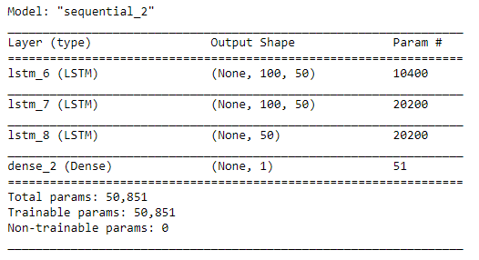
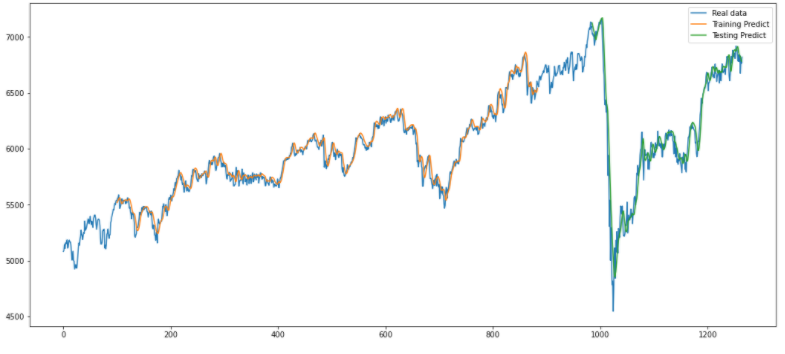
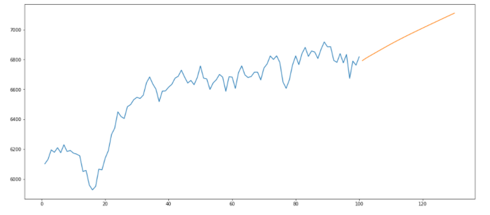
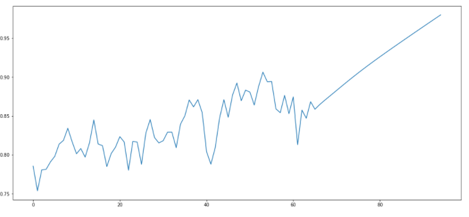

# **ASX Index: 30 Days LSTM Predictions**

---

## **Introduction:**

---

[Long short term memory](https://medium.com/x8-the-ai-community/a-7-minute-introduction-to-lstm-5e1480e6f52a), also know as LSTMs, are a unique type of RNN (recurrent neural network) that are capable of learning long term dependencies and are specifically designed to overcome the long term dependency problem. It is in their nature to remember information for long periods of time which is not possible with simple RNN models. The LSTM outputs the numbers between zero and one which describes how much component should be let through. The number zero means to **let nothing through** whereas, one means to **let everything through**. As we know that the LSTM is great at sequence prediction problems as they are able to store information from the past. This is essential as previous prices are important factor in predicting the future prices of stocks or indexes. 

The [S&P/ASX200](https://www.commbank.com.au/articles/investing/things-to-know-about-the-asx-200.html), launced in April 2000, is known to be Australian benchmark as it is widely known to be representative, liquid and tradable. Only stocks that are regularly trades are included in the index to remain liquid as well as it tracks the largest 200 listed companies and are used as a reference point to check and measure the combined performances of their shares. In june 2019, 44% of the index only included 10 largest stocks, from which 5 out of 10 stocks included banking groups. The [ASX 200](https://capital.com/asx-200-forecast-and-trend) has gained around 113% since it's launh till end of 2019. The index has recently started to rebound from the 2020 gobal economic crash due to pandemic.

## **Purpose of the Project:** 

---

    i) The purpose of the project includes predicting the next 30 days (future) S&P/ASX200 prices using the past "close prices" through LSTM 
    ii) Predicting the market movement with certain accuracy.
    
## **Technologies**

---

    1) Python language
    2) NumPy
    3) Math
    4) Matplotlib
    5) SYS
    6) Warnings
    7) Scikit Learn
    8) Tensorflow (Keras)
    9)Seaborn
    
  
## **Choice of Data Source and Cleaning:**

---

### **Data Source**

[AXJO.csv](AXJO.csv) : retrieved from [Yahoo Finance](https://au.finance.yahoo.com/quote/%5EAXJO/history?p=%5EAXJO)

### **Cleaning Data**

Created a new dataframe **df_price** dropped null values by **df_Price.dropna(inplace=True)** and checked for null values by **df_Price.dropna(inplace=True)**. 

## Calculations
  
    i) LSTM 
    ii) Prediction of future S&P/ASX200 index future price for next 30 days.
    
## **Analysis**

---

After choosing our data source and cleaning the data, the data was normalized using minmaxscaler to be between 0 and 1. Then the dataset was split between 70% training and 30% testing. Next, the data was sequenced with past 100 days of data and reshaped into 3D samples as it is required to be 3 dimensional for LSTM. A LSTM model with a batch size of 64 and epochs of 130 were compiled using Keras and Tensorflow. To avoid data overfitting, dropout layer is added. The image below is the summary of the model:

 

**Model Performance**

The optimized history of loss function is shown in the graph below. From the graph, it is evident that the loss function from the training data and real data has been minised and the gap between the two are really small or unnoticeable. This shows that the data is neither underfit or overfit. Also, the datasets training and testing provides a reasonable accuracy with good predictability. 

**Model Preditiction of future 30 days S&P/ASX200 Index Price**

While predicting the future 30 days index price, it was sequenced with 150 days instead of 100 days for better results and to lessen the gap. As seen in the graph below the price of index is expected to continously increase in the price for the next 30 days. The following result might not be accurate as the index prices are dependant on other internal and external factors besides their past performances based on close price. For example different parameters such as volumn or external factors such as global economy and policies might bring changes to the market movement. 

 

## **Recommendations**

---

If our group was given extra time, the below listed are the improvements which could have been incorporated:

i) Including more than one parameter to the LSTM model to see what would happen to the future 30 days index price predictions.
ii) Link Natural Language Processing (NLP) to the LSTM model to see how the prices are affected with positive, negative or neutral NLP outcomes.
